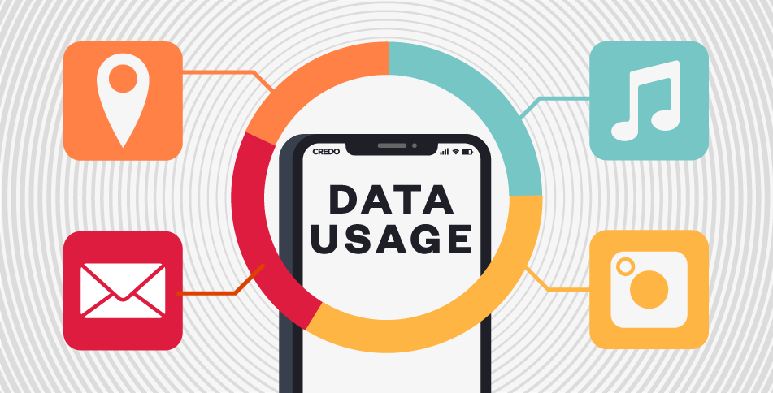

# Kynance Code of Conduct

As a professional financial analysis platform, Kynance is committed to providing users with a fair, transparent, and secure environment. To ensure optimal experience for all users, we've established the following guidelines.

## Account Security

- **Password Security**: Use strong passwords and change them regularly; avoid password reuse across platforms
- **Two-Factor Authentication**: Strongly recommended to enhance account protection
- **Login Monitoring**: System monitors unusual login activities and notifies users of suspicious behavior
- **Personal Information**: Never share account details or trading strategies in public
- **Device Management**: Regularly review authorized devices and remove unused ones

## Data Usage Policy

- **Data Attribution**: When using platform data for external publications, include "Data Source: Kynance"
- **Export Limits**: Daily data export limits apply per account (see membership benefits)
- **API Rate Limits**: Adhere to API call frequency restrictions to avoid system strain
- **Data Accuracy**: While we strive for accuracy, users should verify data before making investment decisions
- **Historical Data Access**: Data depth varies by membership tier (see membership benefits)

## Strategy Development & Backtesting

- **Code Security**: Strategies run in sandboxed environments with restricted API access
- **Resource Limits**: Backtests have computational resource caps; optimize complex strategies
- **Strategy Sharing**: Choose to share strategies or keep private - we respect your IP rights
- **Template Usage**: Follow license terms when using platform-provided strategy templates
- **Backtest Interpretation**: Results are for reference only; past performance ≠ future results

## Community Guidelines

- **Respect**: Maintain professionalism and courtesy in all interactions
- **Quality Content**: Share valuable insights; avoid low-quality posts
- **No Misinformation**: Prohibited to post false or misleading content
- **Disclosures**: Declare potential conflicts when discussing specific financial products
- **Reporting**: Report violations to help maintain healthy community standards

## Platform Usage Tips

- **Browser Compatibility**: Recommended: Latest Chrome, Firefox, or Edge
- **Network Stability**: Stable connections ensure real-time data and smooth backtesting
- **Regular Backups**: Periodically export and backup important strategies and analyses
- **Feature Exploration**: Utilize Help Center to discover full platform capabilities
- **Feedback Channels**: Report issues or suggestions via our feedback system

## Compliance Disclaimer

- **Not Investment Advice**: All platform information/tools are for reference only
- **Risk Disclosure**: Financial investments carry risk - understand products thoroughly
- **Legal Compliance**: Users must comply with local financial regulations
- **Tax Obligations**: Users responsible for understanding applicable tax requirements
- **Privacy Policy**: Platform use constitutes agreement to our Privacy Policy and Terms

We believe following these guidelines helps maintain platform integrity while enhancing your financial analysis effectiveness. Thank you for your cooperation and support!
