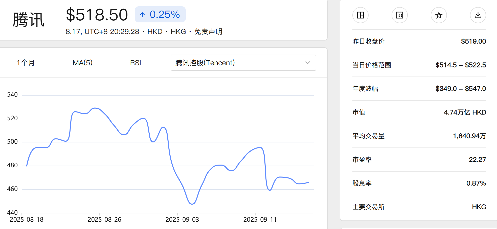
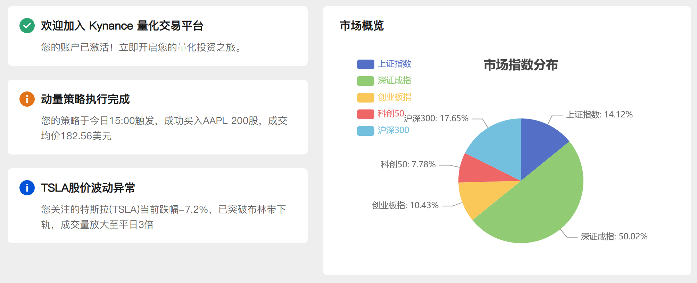

# Kynance Core Features

Kynance provides comprehensive financial charting solutions to meet professional analysis needs. Our platform integrates powerful data analysis, visualization, and strategy backtesting capabilities to help you make informed decisions in financial markets.

## Professional Charting Display


- **Diverse Chart Types**: Supports candlestick, line, bar, pie charts and other professional chart types
- **Real-time Data Updates**: Displays latest market data via WebSocket technology
- **Interactive Operations**: Supports advanced interactions like dragging, zooming, area selection
- **Multi-chart Synchronization**: Automatic scaling synchronization between main chart and sub-chart indicators
- **Discontinuous Data Handling**: Intelligently processes market closing periods for coherent data display

## Powerful Technical Analysis Tools



- **Custom Chart Configuration**: Freely combine technical indicators like K-line, MACD, RSI, MA
- **Multi-dimensional Comparison**: Supports cross-dimensional indicator comparison and combined analysis
- **Detailed Data Display**: Hover to view detailed data and contextual information
- **High-performance Data Processing**: Uses virtual rendering technology to smoothly display millions of historical data points
- **Data Export**: One-click export of analysis charts and data as PDF or CSV reports

## Professional Strategy Backtesting System


- **Visual Strategy Editor**: Intuitively create and edit trading strategies
- **Code Editing Mode**: Supports full-screen editing with preset templates for quick start
- **Secure Sandbox Environment**: Conducts code security checks in Web Worker threads
- **Parameter Optimization**: Supports saving/loading/deleting parameter groups to quickly find optimal configurations
- **Visualized Backtest Results**: Modular display of backtest results for intuitive strategy evaluation
- **Offline Caching**: Uses IndexedDB to cache backtest results for offline viewing

## Market Overview & Watchlists


- **Global Market Snapshot**: View performance across major global markets
- **Custom Filters**: Display personalized data views based on condition/indicator combinations
- **Smart Sorting**: Multi-dimensional sorting to quickly identify market opportunities
- **Watchlist Management**: Easily add, group and monitor stocks of interest
- **Alert System**: Set price or indicator thresholds for timely notifications

## Personalized User Experience


- **Theme System**: Supports day/night mode switching for eye comfort
- **Customizable Layout**: Flexible interface adjustments to suit personal preferences
- **Internationalization**: Seamless switching between Chinese and English interfaces
- **Responsive Design**: Perfect adaptation to different device screen sizes
- **Personal Center**: Centralized management of account info, preferences and usage history

## Support Features



- **Smart Notification System**: Timely alerts for important market events and personal warnings
- **Categorized Documentation**: FAQ organized by categories with keyword search
- **Data Export & Sharing**: Conveniently export analysis results and share insights
- **Account Security**: Multi-factor authentication to protect your account
- **Continuous Updates**: Regular rollout of new features and performance optimizations

```ts
// Example: Creating high-performance candlestick chart with technical indicators
const chart = useChart({
  type: 'candlestick',
  data: reactiveData,
  options: {
    virtual: true, // Enable virtual rendering
    crosshair: {
      sync: ['macd', 'volume', 'rsi'], // Synchronize multiple sub-charts
    },
    theme: userPreference.darkMode ? 'dark' : 'light',
  },
});
```
