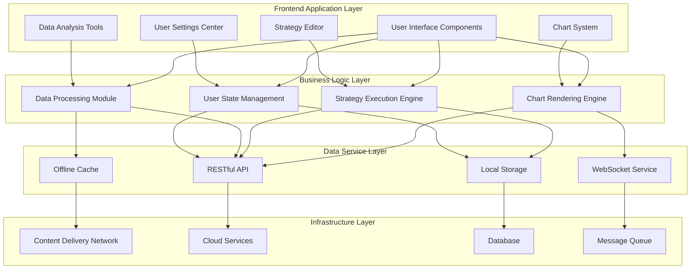
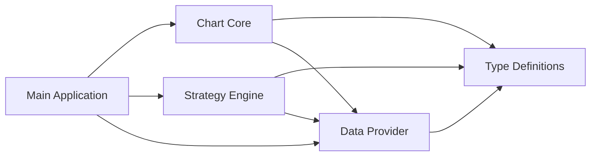

# Technical Architecture and Implementation

## Frontend Technology Stack

Our trading analysis platform adopts a modern frontend technology stack to ensure high performance, scalability, and excellent user experience:

- **Framework**: Vue 3 + TypeScript
- **State Management**: Pinia
- **UI Component Library**: TDesign
- **Build Tool**: Vite
- **Package Management**: pnpm + Monorepo
- **Standards**: commitlint + husky + lint-staged + eslint + prettier + git-cz

## Core Technical Highlights

### High-Performance Chart System

We've implemented an efficient chart rendering system that can smoothly process millions of data points through chunked loading and incremental rendering techniques:

```ts
// Core implementation of chunked data loading
function loadDataInChunks(chart, totalData, chunkSize) {
  let renderedCount = 0;
  function addChunk() {
    const chunk = totalData.slice(renderedCount, renderedCount + chunkSize);
    chart.appendData({ seriesIndex: 0, data: chunk });
    renderedCount += chunkSize;
    if (renderedCount < totalData.length) setTimeout(addChunk, 100);
  }
  addChunk();
}
```

### Big Data Rendering Optimization

To handle rendering large data lists, we've implemented dynamic height virtual scrolling technology that only renders elements within the visible area while supporting dynamic measurement and adjustment of item heights:

```ts
// Dynamic virtual scrolling core implementation
class DynamicVirtualScroll {
  constructor(container, items, estimateHeight, renderItem) {
    this.container = container;
    this.items = items;
    this.estimateHeight = estimateHeight;
    this.renderItem = renderItem;
    this.itemHeights = [];
    this.totalHeight = 0;
    this.init();
  }

  // Core scroll handling logic
  handleScroll() {
    const scrollTop = this.container.scrollTop;
    const clientHeight = this.container.clientHeight;

    // Calculate visible range indices
    let startIndex = this.findStartIndex(scrollTop);
    let endIndex = this.findEndIndex(startIndex, scrollTop, clientHeight);

    // Add buffer and render visible items
    startIndex = Math.max(0, startIndex - 5);
    endIndex = Math.min(this.items.length, endIndex + 5);
    this.renderVisibleItems(startIndex, endIndex);
  }

  // Other helper methods...
}
```

### Strategy Backtesting System

We've developed a secure and reliable strategy backtesting system that isolates user strategy code execution through Web Workers, ensuring system security and stability:

```js
// Strategy validation core process
async function validateStrategyCode(code) {
  const result = { isValid: true, errors: [], warnings: [] };

  // 1. Basic syntax validation
  const runStrategy = validateSyntax(code, result);
  if (!result.isValid) return result;

  // 2. Function signature validation
  validateFunctionSignature(runStrategy, result);
  if (!result.isValid) return result;

  // 3. Test execution using simulated data
  await testExecution(runStrategy, result);
  if (!result.isValid) return result;

  // 4. Security checks - prohibit dangerous APIs
  performSecurityChecks(code, result);

  // 5. Code quality checks
  checkCodeQuality(code, result);

  return result;
}

// Safe execution of strategy code
function executeWithTimeout(func, timeoutMs) {
  return new Promise((resolve, reject) => {
    const timeout = setTimeout(() => reject(new Error(`Execution timeout`)), timeoutMs);
    try {
      Promise.resolve(func())
        .then(resolve)
        .catch(reject)
        .finally(() => clearTimeout(timeout));
    } catch (e) {
      clearTimeout(timeout);
      reject(e);
    }
  });
}
```

---

# Stock Technical Analysis System

## System Overview

This is a stock technical analysis system built on Vue 3 and TypeScript, using the TDesign component library and html2pdf.js for report export functionality. The system generates technical analysis reports by analyzing stock market data and provides visualized assessment metrics.

## Core Features

### 1. Data Calculation and Analysis

- **Latest Data Calculation**: Retrieve and calculate the latest stock data
- **Bid-Ask Ratio Calculation**: Real-time calculation and visualization of bid-ask ratios
- **Multi-dimensional Analysis**:
  - Price trend analysis
  - Volume analysis
  - Price volatility analysis
  - Market state analysis
  - Bid-ask power comparison

### 2. Report Generation

- **Automatic Analysis**: Automatically generate technical analysis reports based on historical data
- **Comprehensive Assessment**: Generate assessments covering 6 dimensions:
  1. Price trend
  2. Trading volume
  3. Price volatility
  4. Market state
  5. Bid-ask balance
  6. Short-term outlook

### 3. Report Export

- **PDF Export**: Export analysis reports in PDF format
- **Custom Configuration**: Support for setting PDF export parameters (margins, quality, format, etc.)

## Technical Implementation

### 1. Core Dependencies

- Vue 3 Composition API
- TypeScript
- TDesign Vue component library
- html2pdf.js (PDF generation)
- Vue Internationalization (i18n)

### 2. Data Storage

- Using Pinia state management to store stock data
- Support for passing external data via props

### 3. Analysis Methods

- **Price Trend Determination**: Based on the ratio of recent up/down days
- **Volume Analysis**: Calculating volume change rates and comparison with average volume
- **Volatility Calculation**: Using standard deviation to calculate price volatility
- **Comprehensive Scoring**: Weighted calculation of multiple indicators for overall rating

## Visualization Components

### 1. Indicator Bars

- Dynamic width and color representing different ratings
- Support for multiple indicator types:
  - Bullish/Bearish series
  - Volatility series

### 2. Label Themes

- Automatically match color themes based on assessment values:
  - Success (green): Strongly bullish/Bullish
  - Primary (blue): Neutral-bullish
  - Warning (orange): Neutral
  - Danger (red): Neutral-bearish/Bearish/Strongly bearish

## Use Cases

1. Technical analysis before stock trading
2. Regular investment portfolio assessment
3. Trading strategy backtesting verification
4. Investment education demonstrations

## Extensibility

- Support for custom data via props
- Analysis methods can be called individually
- Configurable assessment indicators and weights
- Multi-language support (i18n)

## Code Structure

```typescript
<script setup lang="ts">
// 1. Dependency imports
// 2. State management
// 3. Computed properties
// 4. Utility functions
// 5. Analysis methods
// 6. Report generation
// 7. PDF export
// 8. Lifecycle hooks
</script>
```

### Offline Functionality and Cache Optimization

```ts
/**
 * Backtest Data Storage Class
 * Provides storage, query, and management functions for backtest records
 */
export class BacktestStorage {
  private dbHelper: IndexedDBHelper;
  private readonly STORE_NAME = 'backtestRecords';

  /**
   * Constructor
   * @param dbName Database name, defaults to 'kynanceBacktest'
   */
  constructor(dbName: string = 'kynanceBacktest') {
    // Define storage object configuration
    const storeConfigs = [
      {
        name: this.STORE_NAME,
        keyPath: 'id',
        autoIncrement: true,
        indexes: [
          { name: 'date', keyPath: 'date' },
          { name: 'strategy', keyPath: 'backtestConfig.strategy' },
          { name: 'symbol', keyPath: 'backtestConfig.symbol' },
        ],
      },
    ];

    // Create IndexedDB helper class instance
    this.dbHelper = new IndexedDBHelper(dbName, 1, storeConfigs);
  }

  /**
   * Initialize database connection
   * @returns Promise operation result
   */
  async init(): Promise<void> {
    await this.dbHelper.open();
    console.log('Backtest database initialized successfully');
  }

  /**
   * Save backtest record
   * @param record Backtest record
   * @returns Promise saved record (including ID)
   */
  async saveBacktestRecord(record: BacktestRecord): Promise<BacktestRecord> {
    // If no date is specified, use current time
    if (!record.date) {
      record.date = new Date().toLocaleString('en-US');
    }

    try {
      const savedRecord = await this.dbHelper.add<BacktestRecord>(this.STORE_NAME, record);
      console.log('Backtest record saved successfully', savedRecord);
      return savedRecord;
    } catch (error) {
      console.error('Failed to save backtest record', error);
      throw error;
    }
  }

  /**
   * Get backtest records by strategy name
   * @param strategy Strategy name
   * @returns Promise list of backtest records
   */
  async getBacktestRecordsByStrategy(strategy: string): Promise<BacktestRecord[]> {
    try {
      return await this.dbHelper.getAllByIndex<BacktestRecord>(this.STORE_NAME, 'strategy', strategy);
    } catch (error) {
      console.error(`Failed to get backtest records for strategy ${strategy}`, error);
      throw error;
    }
  }

  /**
   * Close database connection
   */
  close(): void {
    this.dbHelper.close();
    console.log('Backtest database connection closed');
  }
}

// Export singleton instance for easy use in the application
export const backtestStorage = new BacktestStorage();
```

### User Experience Optimization


```ts
const changeBrandTheme = (themeColor: string) => {
  // Use theme color plus display mode as key
  const colorKey = `${themeColor}[${mode.value}]`;
  let colorMap = colorList[colorKey];
  // If color scale doesn't exist, calculate it
  if (colorMap === undefined) {
    const [{ colors: newPalette, primary: brandColorIndex }] = Color.getColorGradations({
      colors: [themeColor],
      step: 10,
      remainInput: false, // Whether to preserve input - not preserving will correct unsuitable theme colors
    });
    colorMap = generateColorMap(themeColor, newPalette, mode.value, brandColorIndex);
    colorList[colorKey] = colorMap;
  }
  // TODO Need to solve the problem of repeated style insertion during frequent switching
  insertThemeStylesheet(themeColor, colorMap, mode.value);
  document.documentElement.setAttribute('theme-color', themeColor);
};
```

### Development and Testing Environment

#### Mock Data System

We've built a complete mock data system for development and testing environments.

This mock system has the following features:

- **Real Data Simulation**: Generate simulated data based on real market data characteristics
- **Configurable Response Delays**: Simulate response times in different network environments
- **Intelligent Random Data**: Generate random data that conforms to business logic
- **Multi-scenario Support**: Cover various scenarios including stock lists, K-line data, real-time quotes, etc.
- **Automatic Activation in Development**: Automatically enabled in the development environment without additional configuration

#### Automated Testing System

We've established a comprehensive automated testing system to ensure code quality and system stability:

Our testing system includes:

- **Unit Tests**: Cover core algorithms and business logic
- **Component Tests**: Verify correct rendering and interaction of UI components
- **Integration Tests**: Ensure normal collaboration between different modules
- **E2E Tests**: Simulate real user operation processes
- **Performance Tests**: Monitor key performance indicators and bottlenecks
- **CI/CD Integration**: Automatically execute tests during code submission and deployment

## System Architecture Design

### Overall Architecture Diagram



### Module Dependency Relationships



## Security Measures

- **Data Transmission Encryption**: Site-wide HTTPS + Encrypted Data Transmission
- **Code Execution Sandbox**: Isolated Execution of Strategy Code
- **Fine-grained Permission Control**: Role-based Access Control System
- **Sensitive Operation Verification**: Two-factor Confirmation for Critical Operations

## Extensibility

- **Plugin System**: Support for Third-party Indicators and Strategy Plugins
- **API Integration**: Providing Open API Interfaces
- **Custom Data Sources**: Support for Connecting to Various Data Providers
- **Multi-platform Adaptation**: Reserved Extension Interfaces for Future Mobile/Desktop Platforms

## Technical Challenges and Solutions

| Challenge                             | Solution                                               |
| ------------------------------------- | ------------------------------------------------------ |
| Rendering Lag with Million-level Data | Virtual Scrolling + Data Downsampling + WebWorker      |
| Complex Strategy Execution Security   | Sandbox Isolation + Static Analysis + Timeout Control  |
| Real-time Data Processing Delay       | WebSocket + Incremental Updates + Preloading           |
| Multi-device Responsive Adaptation    | rem Layout + Component Auto-adaptation + Media Queries |
| Offline Functionality Support         | IndexedDB + Service Worker + Local Cache               |

## Future Technology Roadmap

- **AI-assisted Analysis**: Integrating Machine Learning Models to Provide Intelligent Analysis Suggestions
- **WebAssembly Optimization**: Migrating Core Calculation Modules to WASM for Performance Enhancement
- **Real-time Collaboration**: Supporting Multi-user Collaborative Analysis and Strategy Sharing
- **More Visualization Types**: Expanding Advanced Chart Types and 3D Visualization
- **Cloud Strategy Deployment**: Supporting Cloud-based Strategy Execution and Automated Trading
