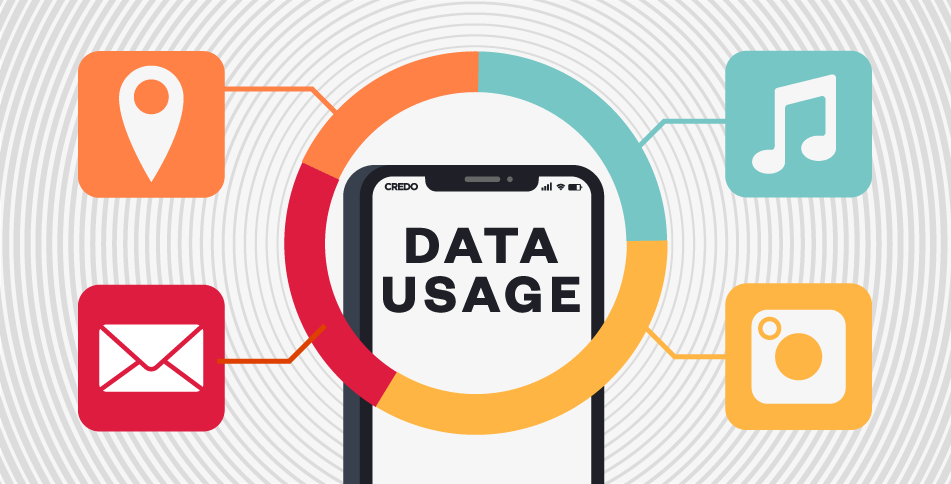

# Kynance 行为规范

作为一个专业的金融分析平台，Kynance 致力于为用户提供公平、透明、安全的使用环境。为确保所有用户能够获得最佳体验，我们制定了以下行为规范。

## 账户安全

- **密码安全**：请使用强密码并定期更换，避免在多个平台使用相同密码
- **双因素认证**：强烈建议开启双因素认证，增加账户安全性
- **登录监控**：系统会监控异常登录行为，发现可疑活动时将通知用户
- **个人信息保护**：请勿在公共场合分享您的账户信息或交易策略
- **设备管理**：定期检查已授权设备列表，移除不再使用的设备

## 数据使用规范

- **数据引用**：使用平台数据进行外部发布时，请注明"数据来源：Kynance"
- **数据导出限制**：个人账户每日数据导出量有所限制，详见会员权益说明
- **API访问频率**：请遵守API调用频率限制，避免对系统造成不必要负担
- **数据准确性**：虽然我们努力确保数据准确，但用户在做出投资决策前应自行验证
- **历史数据访问**：不同会员等级可访问的历史数据深度不同，详见会员权益

## 策略开发与回测

- **代码安全**：策略代码在沙箱环境中运行，禁止访问敏感API和执行危险操作
- **资源限制**：单次回测有计算资源上限，复杂策略请优化代码效率
- **策略分享**：您可以选择分享策略或保持私密，平台尊重您的知识产权
- **模板使用**：使用平台提供的策略模板时，请遵循相关许可条款
- **回测结果解释**：回测结果仅供参考，过往表现不代表未来收益

## 社区互动准则

- **尊重他人**：与其他用户交流时保持礼貌和专业，不发表攻击性言论
- **内容质量**：分享有价值的见解和分析，避免低质量内容
- **禁止误导**：不得发布虚假信息或误导性内容
- **利益声明**：讨论特定金融产品时，请声明可能存在的利益关系
- **举报机制**：发现违规内容，请及时举报，共同维护健康社区环境

## 平台使用建议

- **浏览器兼容性**：推荐使用Chrome、Firefox、Edge等现代浏览器最新版本
- **网络环境**：稳定的网络连接可确保实时数据更新和策略回测的顺利进行
- **定期备份**：建议定期导出并备份重要的策略代码和分析结果
- **功能探索**：通过帮助中心了解平台全部功能，充分利用工具提升分析效率
- **反馈渠道**：遇到问题或有改进建议，请通过反馈系统告诉我们

## 合规免责声明

- **非投资建议**：Kynance提供的所有信息和工具仅供参考，不构成投资建议
- **风险提示**：金融投资存在风险，决策前请充分了解相关产品特性
- **法律法规**：用户应遵守所在地区关于金融投资的法律法规
- **税务责任**：用户应自行了解并履行与投资相关的税务义务
- **隐私政策**：使用本平台即表示您同意我们的隐私政策和服务条款

我们相信，遵循以上行为规范不仅有助于维护平台的良好秩序，也能帮助您更有效地利用Kynance进行金融分析和决策。感谢您的配合与支持！
