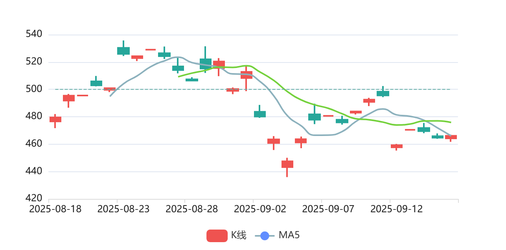
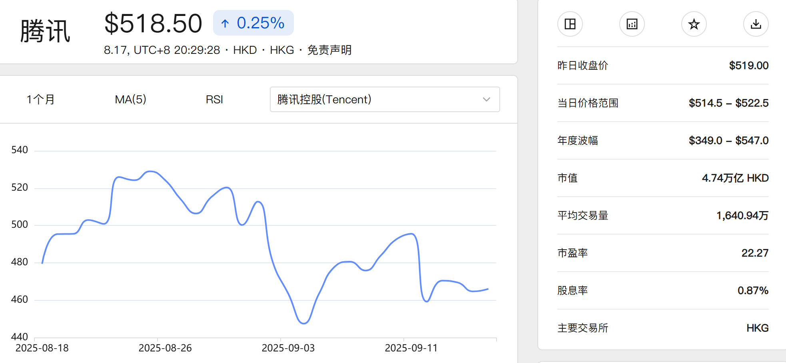
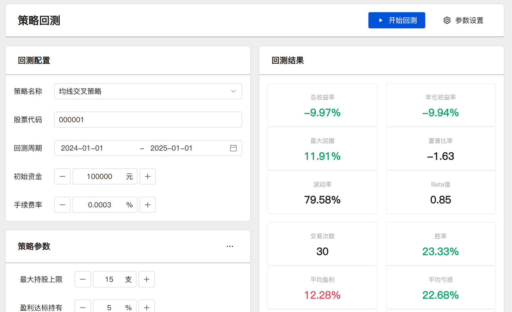
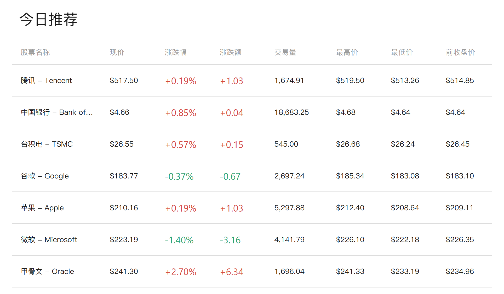
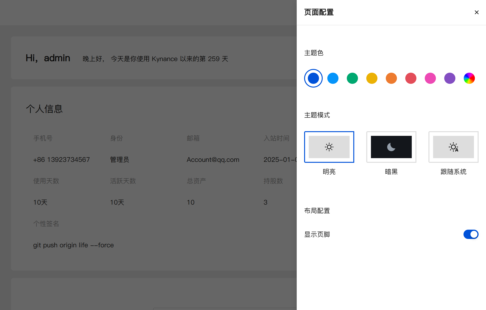
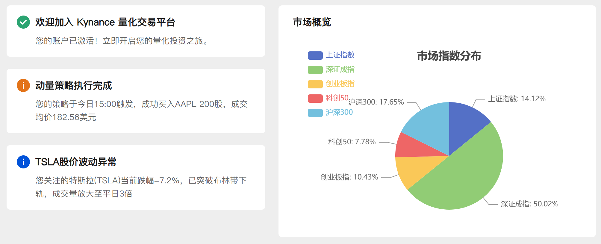

# Kynance 核心功能

Kynance 提供全面的金融图表解决方案，满足专业分析需求。我们的平台集成了强大的数据分析、可视化和策略回测功能，助您在金融市场中做出明智决策。

## 专业级图表展示



- **多样化图表类型**：支持K线图、折线图、柱状图、饼图等多种专业图表
- **实时数据更新**：通过WebSocket技术实时展示最新市场数据
- **交互式操作**：支持拖动、缩放、区域选择等高级交互功能
- **多图表联动**：主图与副图指标自动同步缩放，提供全面分析视角
- **断层数据处理**：智能处理市场休市时段，确保数据展示连贯性

## 强大的技术分析工具



- **自定义图表配置**：自由组合K线、MACD、RSI、MA等技术指标
- **多维度对比分析**：支持跨维度指标比对和组合分析
- **数据细节展示**：鼠标悬停即可查看详细数据与上下文信息
- **高性能数据处理**：采用虚拟渲染技术，流畅展示百万级历史数据
- **数据导出功能**：一键导出分析图表与数据为PDF或CSV报告

## 专业策略回测系统



- **可视化策略编辑器**：直观创建和编辑交易策略
- **代码编辑模式**：支持全屏编辑，提供预设模板快速开始
- **安全沙箱环境**：在Web Worker线程中进行代码安全检测
- **参数优化**：支持保存/读取/删除参数组，快速找到最优配置
- **回测结果可视化**：模块化展示回测结果，直观评估策略表现
- **离线缓存功能**：使用IndexedDB缓存回测结果，支持离线查看

## 市场行情与自选股



- **全市场概览**：一览全球主要市场表现
- **自定义筛选器**：按条件/指标组合展示个性化数据视图
- **智能排序**：多维度排序功能，快速发现市场机会
- **自选股管理**：便捷添加、分组和监控关注的股票
- **预警系统**：设置价格或指标阈值，触发时及时通知

## 个性化用户体验



- **主题系统**：支持日夜间模式切换，保护视力
- **布局自定义**：灵活调整界面布局，满足个人使用习惯
- **国际化支持**：中英文界面无缝切换
- **响应式设计**：完美适配不同设备屏幕尺寸
- **个人中心**：集中管理账户信息、偏好设置和使用记录

## 辅助功能与支持



- **智能通知系统**：重要市场事件和个人预警及时提醒
- **分类帮助文档**：按类别组织的FAQ，支持关键词检索
- **数据导出与分享**：便捷导出分析结果，一键分享见解
- **账户安全保障**：多重身份验证，保护您的账户安全
- **持续更新**：定期推出新功能和性能优化

```ts
// 示例：创建高性能K线图与技术指标
const chart = useChart({
  type: 'candlestick',
  data: reactiveData,
  options: {
    virtual: true, // 启用虚拟渲染
    crosshair: {
      sync: ['macd', 'volume', 'rsi'], // 联动多个副图
    },
    theme: userPreference.darkMode ? 'dark' : 'light',
  },
});
```
