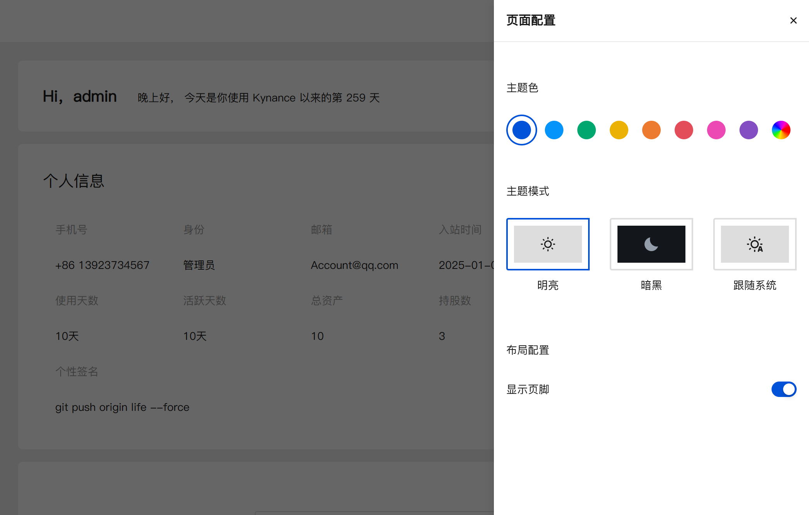

# 技术架构与实现

## 前端技术栈

我们的交易分析平台采用现代化前端技术栈，确保高性能、可扩展性和良好的用户体验：

- **框架**: Vue 3 + TypeScript
- **状态管理**: Pinia
- **UI组件库**: TDesign
- **构建工具**: Vite
- **包管理**: pnpm + Monorepo
- **规范**: commitlint + husky + lint-staged + eslint + prettier + git-cz

## 核心技术亮点

### 高性能图表系统

我们实现了高效的图表渲染系统，通过分块加载和增量渲染技术，可以流畅处理百万级数据点：

```ts
// 分块加载数据核心实现
function loadDataInChunks(chart, totalData, chunkSize) {
  let renderedCount = 0;
  function addChunk() {
    const chunk = totalData.slice(renderedCount, renderedCount + chunkSize);
    chart.appendData({ seriesIndex: 0, data: chunk });
    renderedCount += chunkSize;
    if (renderedCount < totalData.length) setTimeout(addChunk, 100);
  }
  addChunk();
}
```

### 大数据渲染优化

为处理大量数据列表渲染，我们实现了动态高度虚拟滚动技术，只渲染可视区域内的元素，同时支持动态测量和调整项目高度：

```ts
// 动态虚拟滚动核心实现
class DynamicVirtualScroll {
  constructor(container, items, estimateHeight, renderItem) {
    this.container = container;
    this.items = items;
    this.estimateHeight = estimateHeight;
    this.renderItem = renderItem;
    this.itemHeights = [];
    this.totalHeight = 0;
    this.init();
  }

  // 核心滚动处理逻辑
  handleScroll() {
    const scrollTop = this.container.scrollTop;
    const clientHeight = this.container.clientHeight;

    // 计算可见范围索引
    let startIndex = this.findStartIndex(scrollTop);
    let endIndex = this.findEndIndex(startIndex, scrollTop, clientHeight);

    // 添加缓冲区并渲染可见项
    startIndex = Math.max(0, startIndex - 5);
    endIndex = Math.min(this.items.length, endIndex + 5);
    this.renderVisibleItems(startIndex, endIndex);
  }

  // 其他辅助方法...
}
```

### 策略回测系统

我们开发了安全可靠的策略回测系统，通过Web Worker隔离执行用户策略代码，确保系统安全性和稳定性：

```js
// 策略验证核心流程
async function validateStrategyCode(code) {
  const result = { isValid: true, errors: [], warnings: [] };

  // 1. 基本语法验证
  const runStrategy = validateSyntax(code, result);
  if (!result.isValid) return result;

  // 2. 函数签名验证
  validateFunctionSignature(runStrategy, result);
  if (!result.isValid) return result;

  // 3. 使用模拟数据进行测试执行
  await testExecution(runStrategy, result);
  if (!result.isValid) return result;

  // 4. 安全检查 - 禁止使用危险API
  performSecurityChecks(code, result);

  // 5. 代码质量检查
  checkCodeQuality(code, result);

  return result;
}

// 安全执行策略代码
function executeWithTimeout(func, timeoutMs) {
  return new Promise((resolve, reject) => {
    const timeout = setTimeout(() => reject(new Error(`执行超时`)), timeoutMs);
    try {
      Promise.resolve(func())
        .then(resolve)
        .catch(reject)
        .finally(() => clearTimeout(timeout));
    } catch (e) {
      clearTimeout(timeout);
      reject(e);
    }
  });
}
```

---

# 股票技术分析系统

## 系统概述

这是一个基于Vue 3和TypeScript构建的股票技术分析系统，使用TDesign组件库和html2pdf.js实现报告导出功能。系统通过分析股票市场数据生成技术分析报告，并提供可视化评估指标。

## 核心功能

### 1. 数据计算与分析

- **最新数据计算**：获取并计算最新的股票数据
- **买卖盘比例计算**：实时计算买卖盘比例并可视化展示
- **多维度分析**：
  - 价格趋势分析
  - 成交量分析
  - 价格波动性分析
  - 市场状态分析
  - 买卖盘力量对比

### 2. 报告生成

- **自动分析**：基于历史数据自动生成技术分析报告
- **综合评估**：生成包含6个维度的评估项目：
  1. 价格趋势
  2. 成交量
  3. 价格波动
  4. 市场状态
  5. 买卖盘
  6. 短期展望

### 3. 报告导出

- **PDF导出**：将分析报告导出为PDF格式
- **自定义配置**：支持设置PDF导出参数（边距、质量、格式等）

## 技术实现

### 1. 核心依赖

- Vue 3 Composition API
- TypeScript
- TDesign Vue组件库
- html2pdf.js (PDF生成)
- Vue国际化(i18n)

### 2. 数据存储

- 使用Pinia状态管理存储股票数据
- 支持通过props传入外部数据

### 3. 分析方法

- **价格趋势判断**：基于近期涨跌天数比例
- **成交量分析**：计算成交量变化率和与平均成交量比值
- **波动性计算**：使用标准差计算价格波动率
- **综合评分**：加权计算多项指标得出总体评级

## 可视化组件

### 1. 指标条

- 动态宽度和颜色表示不同评级
- 支持多种指标类型：
  - 看多/看空系列
  - 波动性系列

### 2. 标签主题

- 根据评估值自动匹配颜色主题：
  - 成功(绿色)：强烈看多/看多
  - 主要(蓝色)：中性偏多
  - 警告(橙色)：中性
  - 危险(红色)：中性偏空/看空/强烈看空

## 使用场景

1. 股票交易前的技术面分析
2. 投资组合定期评估
3. 交易策略回测验证
4. 投资教育演示

## 扩展性

- 支持通过props传入自定义数据
- 分析方法可单独调用
- 评估指标和权重可配置
- 多语言支持(i18n)

## 代码结构

```typescript
<script setup lang="ts">
// 1. 依赖导入
// 2. 状态管理
// 3. 计算属性
// 4. 工具函数
// 5. 分析方法
// 6. 报告生成
// 7. PDF导出
// 8. 生命周期钩子
</script>
```

### 离线功能与缓存优化

```ts
/**
 * 回测数据存储类
 * 提供回测记录的存储、查询和管理功能
 */
export class BacktestStorage {
  private dbHelper: IndexedDBHelper;
  private readonly STORE_NAME = 'backtestRecords';

  /**
   * 构造函数
   * @param dbName 数据库名称，默认为 'kynanceBacktest'
   */
  constructor(dbName: string = 'kynanceBacktest') {
    // 定义存储对象配置
    const storeConfigs = [
      {
        name: this.STORE_NAME,
        keyPath: 'id',
        autoIncrement: true,
        indexes: [
          { name: 'date', keyPath: 'date' },
          { name: 'strategy', keyPath: 'backtestConfig.strategy' },
          { name: 'symbol', keyPath: 'backtestConfig.symbol' },
        ],
      },
    ];

    // 创建 IndexedDB 工具类实例
    this.dbHelper = new IndexedDBHelper(dbName, 1, storeConfigs);
  }

  /**
   * 初始化数据库连接
   * @returns Promise 操作结果
   */
  async init(): Promise<void> {
    await this.dbHelper.open();
    console.log('回测数据库初始化成功');
  }

  /**
   * 保存回测记录
   * @param record 回测记录
   * @returns Promise 保存的记录（包含ID）
   */
  async saveBacktestRecord(record: BacktestRecord): Promise<BacktestRecord> {
    // 如果没有指定日期，则使用当前时间
    if (!record.date) {
      record.date = new Date().toLocaleString('zh-CN');
    }

    try {
      const savedRecord = await this.dbHelper.add<BacktestRecord>(this.STORE_NAME, record);
      console.log('回测记录保存成功', savedRecord);
      return savedRecord;
    } catch (error) {
      console.error('保存回测记录失败', error);
      throw error;
    }
  }

  /**
   * 根据策略名称获取回测记录
   * @param strategy 策略名称
   * @returns Promise 回测记录列表
   */
  async getBacktestRecordsByStrategy(strategy: string): Promise<BacktestRecord[]> {
    try {
      return await this.dbHelper.getAllByIndex<BacktestRecord>(this.STORE_NAME, 'strategy', strategy);
    } catch (error) {
      console.error(`获取策略为${strategy}的回测记录失败`, error);
      throw error;
    }
  }

  /**
   * 关闭数据库连接
   */
  close(): void {
    this.dbHelper.close();
    console.log('回测数据库连接已关闭');
  }
}

// 导出单例实例，方便在应用中使用
export const backtestStorage = new BacktestStorage();
```

### 用户体验优化



```ts
const changeBrandTheme = (themeColor: string) => {
  // 以主题色加显示模式作为键
  const colorKey = `${themeColor}[${mode.value}]`;
  let colorMap = colorList[colorKey];
  // 如果不存在色阶，就需要计算
  if (colorMap === undefined) {
    const [{ colors: newPalette, primary: brandColorIndex }] = Color.getColorGradations({
      colors: [themeColor],
      step: 10,
      remainInput: false, // 是否保留输入 不保留会矫正不合适的主题色
    });
    colorMap = generateColorMap(themeColor, newPalette, mode.value, brandColorIndex);
    colorList[colorKey] = colorMap;
  }
  // TODO 需要解决不停切换时有反复插入 style 的问题
  insertThemeStylesheet(themeColor, colorMap, mode.value);
  document.documentElement.setAttribute('theme-color', themeColor);
};
```

### 开发与测试环境

#### Mock数据系统

我们构建了一套完整的模拟数据系统，用于开发和测试环境

这套Mock系统具有以下特点：

- **真实数据模拟**：基于真实市场数据特征生成模拟数据
- **可配置的响应延迟**：模拟不同网络环境下的响应时间
- **智能随机数据**：生成符合业务逻辑的随机数据
- **多场景支持**：覆盖股票列表、K线数据、实时行情等多种场景
- **开发环境自动激活**：在开发环境中自动启用，无需额外配置

#### 自动化测试体系

我们建立了完整的自动化测试体系，确保代码质量和系统稳定性：

我们的测试体系包括：

- **单元测试**：覆盖核心算法和业务逻辑
- **组件测试**：验证UI组件的正确渲染和交互
- **集成测试**：确保不同模块之间的协作正常
- **E2E测试**：模拟真实用户操作流程
- **性能测试**：监控关键性能指标和瓶颈
- **CI/CD集成**：在代码提交和部署过程中自动执行测试

## 系统架构设计

### 整体架构图


### 模块依赖关系


## 性能优化与指标

### 关键性能指标

| 指标类别     | 指标名称          | 目标值            | 优化方法                         |
| ------------ | ----------------- | ----------------- | -------------------------------- |
| **加载性能** | 首屏加载时间      | < 2秒 (95%用户)   | 路由懒加载、资源预加载、代码分割 |
|              | 首次内容绘制(FCP) | < 1.2秒           | 关键CSS内联、预连接关键域        |
|              | 最大内容绘制(LCP) | < 2.5秒           | 图片优化、资源优先级             |
| **渲染性能** | 图表渲染帧率      | 稳定60fps         | 虚拟列表、WebGL加速、离屏渲染    |
|              | 大数据渲染时间    | 百万级数据 < 1秒  | 数据分块、增量渲染、WebWorker    |
|              | 交互响应时间      | < 100ms           | 事件委托、节流防抖、计算缓存     |
| **网络性能** | 实时数据延迟      | < 300ms           | WebSocket、数据压缩、增量更新    |
|              | API响应时间       | < 500ms           | 接口合并、数据缓存、预请求       |
| **计算性能** | 策略回测速度      | 5年历史数据 < 3秒 | 算法优化、WebAssembly、并行计算  |
|              | 指标计算速度      | 复杂指标 < 200ms  | 计算缓存、惰性计算、增量计算     |
| **资源占用** | 内存峰值          | < 500MB           | 内存池、对象复用、垃圾回收优化   |
|              | CPU使用率         | 峰值 < 30%        | 计算分离、任务调度、空闲处理     |

## 安全保障

- **数据传输加密**：全站HTTPS + 数据加密传输
- **代码执行沙箱**：策略代码隔离执行
- **权限精细控制**：基于角色的访问控制系统
- **敏感操作验证**：关键操作二次确认

## 扩展能力

- **插件系统**：支持第三方指标与策略插件
- **API集成**：提供开放API接口
- **自定义数据源**：支持接入多种数据提供商
- **多端适配**：为未来移动端/桌面端预留扩展接口

## 技术挑战与解决方案

| 挑战               | 解决方案                              |
| ------------------ | ------------------------------------- |
| 百万级数据渲染卡顿 | 虚拟滚动 + 数据降采样 + WebWorker     |
| 复杂策略执行安全   | 沙箱隔离 + 静态分析 + 超时控制        |
| 实时数据处理延迟   | WebSocket + 增量更新 + 预加载         |
| 多设备响应式适配   | rem布局 + 组件自适应 + 媒体查询       |
| 离线功能支持       | IndexedDB + Service Worker + 本地缓存 |

## 未来技术规划

- **AI辅助分析**：集成机器学习模型提供智能分析建议
- **WebAssembly优化**：核心计算模块迁移至WASM提升性能
- **实时协作功能**：支持多用户协同分析与策略共享
- **更多可视化类型**：扩展高级图表类型与3D可视化
- **云端策略部署**：支持策略云端运行与自动交易
