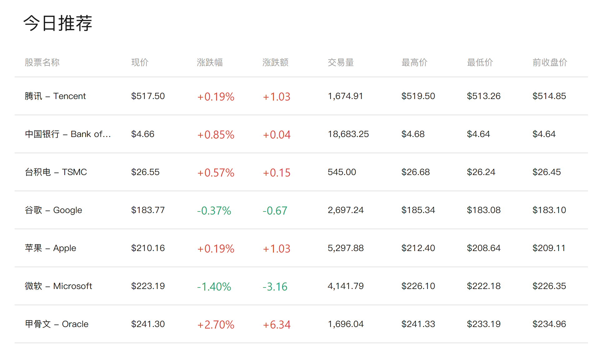
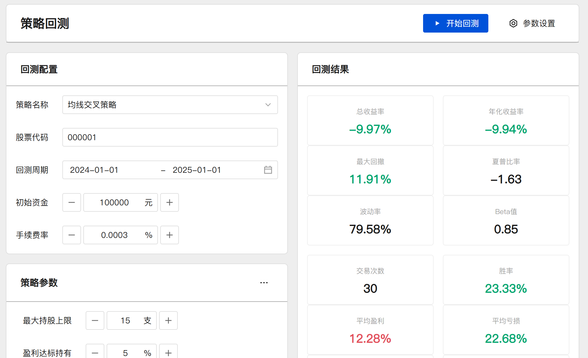

# 技术架构与实现

## 前端技术栈

我们的交易分析平台采用现代化前端技术栈，确保高性能、可扩展性和良好的用户体验：

- **框架**: Vue 3 + TypeScript
- **状态管理**: Pinia
- **UI组件库**: 定制化组件系统
- **构建工具**: Vite
- **包管理**: pnpm + Monorepo

## 核心技术亮点

### 高性能图表系统


- **多样化图表类型**：支持K线图、折线图、柱状图、饼图等多种图表类型
- **断层数据处理**：智能处理交易时段中断（如午休时段）的数据展示
- **自定义指标组合**：用户可自由配置K线与技术指标（MACD/RSI/MA等）的组合展示
- **高级交互功能**：
  - 图表拖动与缩放
  - 区域选择分析
  - 多图表联动
  - 十字光标同步

### 实时数据处理

- **WebSocket实时连接**：建立高效的实时数据通道
- **增量数据更新**：只传输变化数据，减少网络负载
- **数据缓冲与平滑处理**：确保数据更新不影响UI流畅度
- **自动重连机制**：网络波动时智能恢复连接

### 大数据渲染优化



- **虚拟滚动技术**：高效渲染百万级历史数据
- **数据分片加载**：按需加载数据，优化内存使用
- **WebWorker多线程处理**：将复杂计算迁移至独立线程
- **GPU加速渲染**：利用硬件加速提升图表绘制性能

### 策略回测系统



- **策略编辑器**：

  - 代码高亮与智能提示
  - 全屏编辑模式
  - 预设策略模板
  - 一键部署测试

- **安全沙箱执行**：

  - Web Worker隔离环境
  - 代码静态分析检测
  - 执行时间限制
  - 危险API拦截

- **回测结果可视化**：
  - 多维度性能指标
  - 交易记录详情
  - 盈亏曲线分析
  - 风险评估报告

### 数据分析与导出

- **多维度对比分析**：支持不同指标、时间段的组合对比
- **自定义筛选器**：灵活构建数据视图
- **详情悬停提示**：鼠标悬停显示丰富的上下文信息
- **报告导出功能**：
  - PDF报告生成
  - CSV数据导出
  - 自定义报告模板

### 离线功能与缓存优化

- **IndexedDB数据存储**：

  - 回测结果本地缓存
  - 用户配置持久化
  - 历史查询记录保存

- **Service Worker离线支持**：
  - 核心功能离线可用
  - 数据预缓存策略
  - 后台同步更新

### 用户体验优化


- **响应式设计**：

  - rem单位统一布局
  - 适配多种屏幕尺寸
  - 组件自适应调整

- **主题系统**：

  - 日/夜间模式切换
  - 主题色个性化
  - 布局结构自定义

- **国际化支持**：
  - 中英文界面切换
  - 自动语言检测
  - 动态加载语言包

### 开发与测试

- **Mock数据系统**：

  - 模拟真实数据接口
  - 可配置的响应延迟
  - 随机数据生成器

- **自动化测试**：
  - 单元测试覆盖核心逻辑
  - E2E测试保障用户流程
  - 性能测试监控关键指标

## 技术架构图

```
┌─────────────────────────────────────────────────────────────┐
│                      用户界面层                             │
│  ┌─────────┐  ┌─────────┐  ┌─────────┐  ┌─────────────┐    │
│  │ 图表组件 │  │ 策略编辑 │  │ 数据分析 │  │ 用户中心/设置 │    │
│  └─────────┘  └─────────┘  └─────────┘  └─────────────┘    │
├─────────────────────────────────────────────────────────────┤
│                      业务逻辑层                             │
│  ┌─────────┐  ┌─────────┐  ┌─────────┐  ┌─────────────┐    │
│  │ 图表引擎 │  │ 策略引擎 │  │ 数据处理 │  │ 用户状态管理 │    │
│  └─────────┘  └─────────┘  └─────────┘  └─────────────┘    │
├─────────────────────────────────────────────────────────────┤
│                      数据服务层                             │
│  ┌─────────┐  ┌─────────┐  ┌─────────┐  ┌─────────────┐    │
│  │ API接口 │  │WebSocket│  │本地存储 │  │  离线缓存   │    │
│  └─────────┘  └─────────┘  └─────────┘  └─────────────┘    │
└─────────────────────────────────────────────────────────────┘
```

## 性能指标

- **首屏加载时间**：< 2秒 (95%用户)
- **图表渲染性能**：60fps流畅度 (百万级数据)
- **实时数据延迟**：< 300ms
- **策略回测速度**：5年历史数据 < 3秒
- **内存占用优化**：峰值 < 500MB

## 安全保障

- **数据传输加密**：全站HTTPS + 数据加密传输
- **代码执行沙箱**：策略代码隔离执行
- **权限精细控制**：基于角色的访问控制系统
- **敏感操作验证**：关键操作二次确认

## 扩展能力

- **插件系统**：支持第三方指标与策略插件
- **API集成**：提供开放API接口
- **自定义数据源**：支持接入多种数据提供商
- **多端适配**：为未来移动端/桌面端预留扩展接口

## 技术挑战与解决方案

| 挑战               | 解决方案                              |
| ------------------ | ------------------------------------- |
| 百万级数据渲染卡顿 | 虚拟滚动 + 数据降采样 + WebWorker     |
| 复杂策略执行安全   | 沙箱隔离 + 静态分析 + 超时控制        |
| 实时数据处理延迟   | WebSocket + 增量更新 + 预加载         |
| 多设备响应式适配   | rem布局 + 组件自适应 + 媒体查询       |
| 离线功能支持       | IndexedDB + Service Worker + 本地缓存 |

## 未来技术规划

- **AI辅助分析**：集成机器学习模型提供智能分析建议
- **WebAssembly优化**：核心计算模块迁移至WASM提升性能
- **实时协作功能**：支持多用户协同分析与策略共享
- **更多可视化类型**：扩展高级图表类型与3D可视化
- **云端策略部署**：支持策略云端运行与自动交易
